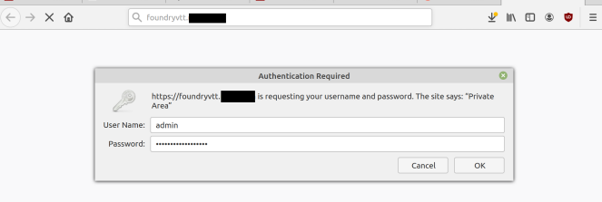
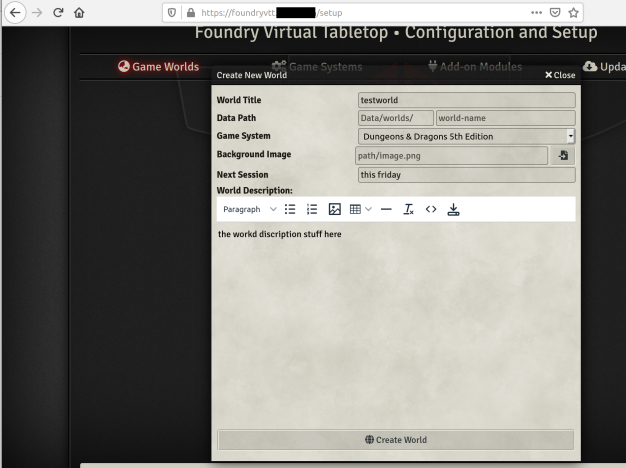
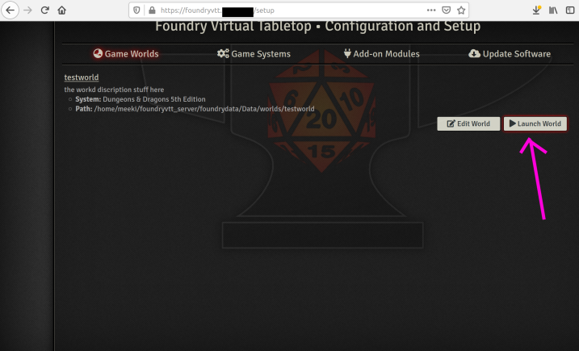
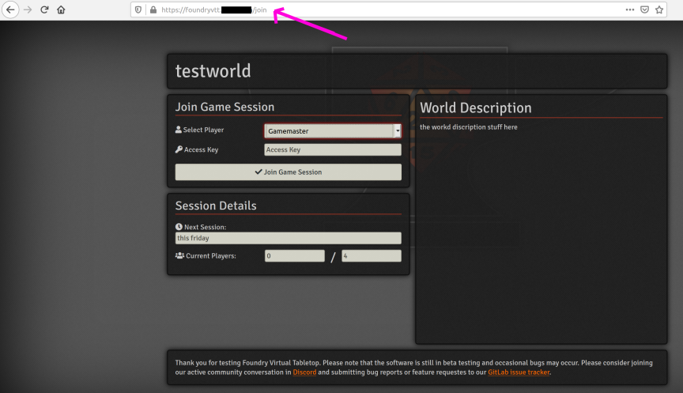
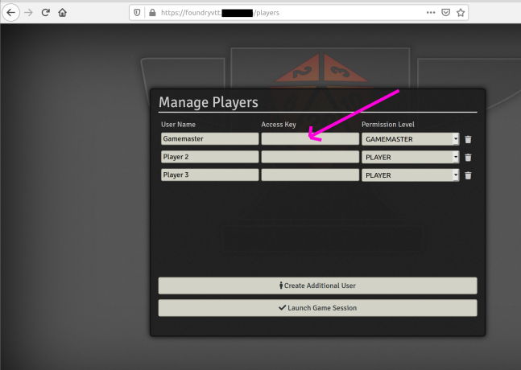
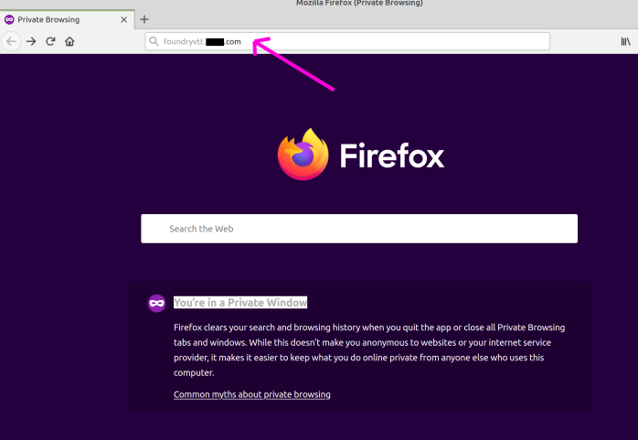
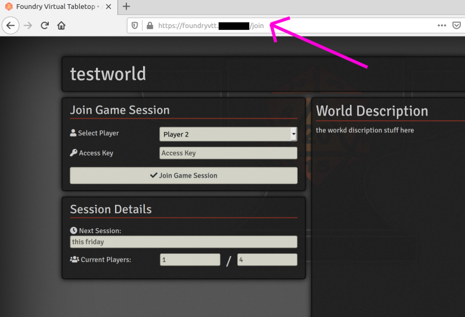
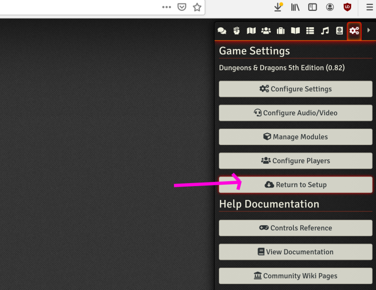

# FoundryVTT
## Ubuntu 18.04 - nigix - https - ssl - basic auth - security

### Contributors
LogosWorks - Upaded howto - Fix for 1MB Upload limit in the Nginx Config file [https://github.com/meeki007/FoundryVTT-Server-HowTo/issues/1](https://github.com/meeki007/FoundryVTT-Server-HowTo/issues/1)

## Table of Contents
* [Introduction](#Introduction)
* [Setup_Server](#Setup_Server)
    * [Creating_a_new_privileged_user_account](#Creating_a_new_privileged_user_account)
    * [Update_Server](#Update_Server)
    * [Enable_a_firewall](#Enable_a_firewall)
    * [Install_Fail2ban](#Install_Fail2ban)
* [FoundryVTT](#FoundryVTT)
    * [libssl_dev](#libssl_dev)
    * [nodejs](#nodejs)
    * [Create_Directories](#Create_Directories)
    * [Download_Extract_foundryvtt](#Download_Extract_foundryvtt)
    * [Running_foundryvtt](#Running_foundryvtt)
    * [Testing_foundryvtt_Connection](#Testing_foundryvtt_Connection)
* [Hosting_to_the_world](#Hosting_to_the_world)
    * [Install_Nginx](#Install_Nginx)
    * [DNS](#DNS)
    * [Reverse_proxy](#Reverse_proxy)
    * [HTTPS_SSL_certbot](#HTTPS_SSL_certbot)
    * [Securing_Setup_Page](#Securing_Setup_Page)
* [Backup_Recovery](#Backup_Recovery)
* [First_use_and_how_users_login](#First_use_and_how_users_login)


## Introduction
This Guide is for setting up a <b>secure</b> Dedicated Server.
<br>
This guide assumes you have a running server with Ubuntu 18.04 and that you have access to terminal on the server. You can host this yourself however this guide does not address port forwarding from routers or DMZ settings and or ipv6 settings.

You need a Domain Name and the ability to point it to your IP address. Let’s Encrypt doesn’t issue certificates for bare IP addresses, only domain names. You’ll need to register a domain name in order to get a Let’s Encrypt certificate.

What your server needs: a visable IP address to the internet to include if you wish a ipv6 address.

I used a VPS (Virtual Private Server) provider. For less than $10 a month, I have a server, and I have complete root access to and can spin up Ubuntu on. I used https://servercheap.net/pricing.php I was not paid or compensated to link them. Its just what I use.
<br>
<br>
If all you are going to use this server for is FoundryVTT you will only need 1gb of ram and 1 cpu however I recommend 2gb of ram and 2 cpu's
<br>
<br>
MORE! ram and cpu if you plan on running video chat and voice across multiple players. You can always upgrade/pay for more as needed
<br>
<br>
This Guide is <b>not</b> for individuals who fear the CLI (command line interface). If you have issues your going to need to read and search. You can always open an issue here https://github.com/meeki007/FoundryVTT-Server-HowTo/issues and if i have time I can try to help.
<br>

## Setup_Server
Bring up a terminal on the server
<br>

##### Creating_a_new_privileged_user_account
You should never log into your server as root. example ssh root@youripaddress
If you have not or no privileged user account exists lets create one.
<br>
If you have a privileged user account you can skip this step
<br>
<br>
In terminal:
```
$ adduser YourChosenNameHere
```
<br>

Give your new user account sudo rights by appending (-a) the sudo group (-G) to the user’s group membership:
<br>
<br>
In terminal:
```
$ usermod -a -G sudo YourChosenNameHere
```

<br>
Exit root account and login with the new privileged user account you have created
<br>
<br>

##### Update_Server
Update the local repositories and upgrade the operating system and installed applications by applying the latest patches.
<br>
Keep settings or files during the upgrade if asked. Follow the suggestions presented in terminal
<br>
<br>
In terminal:
```
$ sudo apt update && sudo apt upgrade -y
```
<br>
<br>

##### Enable_a_firewall
If you have a firewall setup you can skip this step.
<br>
<br>
Install a firewall, enable it, and configure it only to allow network traffic that you designate
<br>
<br>
In terminal:
```
$ sudo apt install ufw
```
<br>

UFW (universal firewall) denies all incoming connections and allows all outgoing connections
<br>
Enable access to SSH, HTTP, and HTTPS
<br>
<br>
In terminal:
```
$ sudo ufw allow ssh
```
```
$ sudo ufw allow http
```
```
$ sudo ufw allow https
```
<br>

Now lets start UFW
<br>
<br>
In terminal:
```
$ sudo ufw enable
```

<br>

You can see what services are allowed and denied with:
<br>
<br>
In terminal:
```
$ sudo ufw status
```
<br>

If you ever want to disable UFW, you can do so by typing:
<br>
<br>
In terminal:
```
$ sudo ufw disable
```
<br>
<br>

##### Install_Fail2ban
Fail2ban is an application that examines server logs looking for repeated or automated attacks. If any are found, it will alter the firewall to block the attacker’s IP address either permanently or for a specified amount of time.
<br>
<br>
In terminal:
```
$ sudo apt install fail2ban -y
```
<br>

Copy the included configuration file
<br>
<br>
In terminal:

```
$ sudo cp /etc/fail2ban/jail.conf /etc/fail2ban/jail.local
```
<br>

And restart Fail2ban
<br>
<br>
In terminal:
```
$ sudo service fail2ban restart
```
<br>
<br>

## FoundryVTT
We need to install some packages required before installing and running FoundryVTT.
<br>
<br>
##### libssl_dev
Install development libraries, header files, and manpages for libssl and libcrypto
<br>
<br>
In terminal:

```
$ sudo apt install -y libssl-dev
```
<br>
<br>

##### nodejs
Install nodejs
<br>
<br>
In terminal:

```
$ curl -sL https://deb.nodesource.com/setup_10.x | sudo bash -
```
```
$ sudo apt install -y nodejs
```
<br>
<br>

##### Create_Directories
Create application and user data directories /foundryvtt and /foundrydata
<br>
We need to make these directories in our current privileged_user_account /home/YourChosenNameHere/ location
<br>
We can use $HOME variable to accomplish this
<br>
<br>
In terminal:
```
$ mkdir -p $HOME/foundryvtt_server/{foundryvtt,foundrydata}
```
<br>
<br>

##### Download_Extract_foundryvtt
Move to the foundryvtt_server directory /home/YourChosenNameHere/foundryvtt_server/
<br>
In terminal:
```
$ cd $HOME/foundryvtt_server
```
<br>
<br>
Goto the FoundryVTT patreon page https://www.patreon.com/foundryvtt/posts
<br>
Download and extract the latest Foundry Virtual Tabletop Linux version from Patreon
<br>
<br>

In terminal:
```
$ wget https://patreon-link-here.zip -O foundryvtt.zip
```
Or if wget does not work use sftp to move the FoundryVTT.zip file to the /foundryvtt_server directory manually and rename it to foundryvtt.zip
<br>
<br>

Unzip the file to the /home/YourChosenNameHere/foundryvtt_server/foundryvtt/ directory
<br>
You may have to install unzip if its not installed on your server with: $ sudo apt-get install -y unzip
<br>
<br>
In terminal:
```
$ unzip foundryvtt.zip -d /$HOME/foundryvtt_server/foundryvtt/
```
<br>
<br>

##### Running_foundryvtt
PM2 is a process manager for Node.js
<br>
Starting, stopping and monitoring foundryvtt at boot time and auto booting/restarting automatically will be done with pm2. This way if the server reboots or hangs foundryvtt will startup automatically
<br>
<br>
In terminal:
```
$ sudo npm install -g pm2
```
<br>
<br>
Start foundryvtt with pm2
<br>
<br>

In terminal:
```
$ pm2 start $HOME/foundryvtt_server/foundryvtt/resources/app/main.js -- --port=30000 --dataPath=/$HOME/foundryvtt_server/foundrydata
```
<br>
<br>
Save the current pm2 setup
<br>
<br>

In terminal:
```
$ pm2 save
```
<br>
<br>
pm2 Startup Script Generation
<br>
<br>

In terminal:
```
$ pm2 startup systemd
```
<b>You should have got the opt-put asking you to:</b>
<br>
"[PM2] You have to run this command as root. Execute the following command:""
<br>
Make sure you copy and paste the command to the terminal and run it.
<br>
<br>

##### Testing_foundryvtt_Connection
Foundryvtt should now be running. The fire wall is blocking the port at the moment.
<br>
<br>
Disable the firewall so we can test that the server is running/Hosting_to_the_world
<br>
<br>

In terminal:
```
$ sudo ufw disable
```
In your web browser of choice enter in http://your_server_ip:30000
<br>
<br>
foundryvtt setup page should load. I know its tempting but do not configure it now. exit the page / close the browser.
<br>
<br>
Enable the firewall because Right now any one on the web can access your foundryvtt servers setup page
<br>
<br>

In terminal:
```
$ sudo ufw enable
```

## Hosting_to_the_world
We need to setup our DNS for our domain. Install Nginx to reverse proxy so users don't have to enter a port to get to the server. Install Lets encrypt certbot to issue ssl certificates and automate the process so you never have to manually renew ssl certificates; also so users can access the site using https for security and so browsers will not complain and block access. Setup Nginx auth for the /setup page so random people on the internet can't mess with your server.

##### Install_Nginx
Nginx is a web server which can also be used as a reverse proxy.
<br>
By default, Nginx is configured to start automatically when the server boots/reboots

In terminal:
```
$ sudo apt install nginx
```
Check to see if Nginx is running

In terminal:
```
$ systemctl status nginx
```
Check to see if Nginx is hosting properly.
<br>
In a web browser type your servers ip address with no port. IE http://server_ip
<br>
You should see a welcome to nginx page


##### DNS
You need to tie your server ipv4 and if you have one ipv6 addresses to you DNS records.
I like to use subdomains for my reverse proxy needs in Nginx.
<br>
<br>
Log into your domain name hosting provider of choice and add some records.
<br>
<br>
DNS advice is outside the scope of this tutorial. You will need to learn and or ask your provider for help if you do not understand the steps below.
<br>
<br>
Create an A record for your ipv4 server address.
<br>
Create an AAAA record for your ipv6 server address.
<br>
Now Create a CNAME record pointing a subdomain of foundryvtt to your domain name. IE your_domain_name.com
<br>
<br>
It should look somting like this:
<br>

| Hostname          | Type           | Address / Value      |
| :---------------: |:--------------:|:--------------------:|
|                   | A              | server_ipv4_address  |
|                   | AAAA           | server_ipv6_address  |
| www               | CNAME          | your_domain_name.com |
| foundryvtt        | CNAME          | your_domain_name.com |

The goal of all this is to create the address foundryvtt.your_domain_name.com for users to access
<br>
You can pick a subdomain name of your choice.

Testing that your domain works with Nginx. Enter your domain name. http://your_domain_name.com

You should see a welcome to nginx page

If not DO NOT PASS GO. Fix your domain issues.

##### Reverse_proxy
This is used so when users goto foundryvtt.your_domain_name.com they are directed to the FoundryVTT server running on port :30000

First create a server block file for the url , making sure to change:
<br>
<b>server_name foundryvtt.your_domain_name.com;</b>
<br>
To the subdomain.domain.com that you own

In terminal:
```
$ sudo nano /etc/nginx/sites-available/foundryvtt.your_domain_name.com
```
This will open a text editor

Paste the following into the editor, making sure to change one line:
<br>
<b>server_name foundryvtt.your_domain_name.com;</b>
<br>
To the subdomain.domain.com that you own
```
#proxy for foundryvtt @ port :30000
server {
    	listen 80;
	listen [::]:80;

    	server_name foundryvtt.your_domain_name.com;

    	location = /robots.txt {
    		add_header  Content-Type  text/plain;
    		return 200 "User-agent: *\nDisallow: /\n";
    	}
    	location / {
       		proxy_pass http://127.0.0.1:30000;

		#Defines the HTTP protocol version for proxying
		#by default it it set to 1.0.
		#For Websockets and keepalive connections you need to use the version 1.1
		proxy_http_version  1.1;

		#Sets conditions under which the response will not be taken from a cache.
		proxy_cache_bypass  $http_upgrade;

		#These header fields are required if your application is using Websockets
		proxy_set_header Upgrade $http_upgrade;

		#These header fields are required if your application is using Websockets
		proxy_set_header Connection "upgrade";

		#The $host variable in the following order of precedence contains:
		#hostname from the request line, or hostname from the Host request header field
		#or the server name matching a request.
		proxy_set_header Host $host;

		#Forwards the real visitor remote IP address to the proxied server
		proxy_set_header X-Real-IP $remote_addr;

		#A list containing the IP addresses of every server the client has been proxied through
		proxy_set_header X-Forwarded-For $proxy_add_x_forwarded_for;

		#When used inside an HTTPS server block, each HTTP response from the proxied server is rewritten to HTTPS.
		proxy_set_header X-Forwarded-Proto $scheme;

		#Defines the original host requested by the client.
		proxy_set_header X-Forwarded-Host $host;

		#Defines the original port requested by the client.
		proxy_set_header X-Forwarded-Port $server_port;

    	}
}
```

Now enable the file by creating a link from it to the sites-enabled directory, which Nginx reads from during startup:
<br>
making sure to change:
<br>
<b>server_name foundryvtt.your_domain_name.com;</b>
<br>
To the subdomain.domain.com that you own

In terminal:
```
$ sudo ln -s /etc/nginx/sites-available/foundryvtt.your_domain_name.com /etc/nginx/sites-enabled/
```


To avoid a possible hash bucket memory problem that can arise from adding additional server names, and to Sets the maximum allowed size of the client request body, specified in the “Content-Length” request header field. It is necessary to adjust values in the /etc/nginx/nginx.conf file. Open the file:

In terminal:
```
$ sudo nano /etc/nginx/nginx.conf
```
Now uncomment (remove the # symbol) from the http section line <b>server_names_hash_bucket_size 64;</b> and change the <b>client_max_body_size 100M</b> so it looks like this:

```
http {
    ...ignore stuff here...
    server_names_hash_bucket_size 64;
    ...ignore stuff here...
    client_max_body_size 100M;
    ...ignore stuff here...
}
```
NOTE: if you need to upload files/images larger than 100M to the server please increase this value for your needs.

Next, test to make sure that there are no syntax errors in any of your Nginx files:

In terminal:
```
$ sudo nginx -t
```

Restart Nginx to enable your changes:

In terminal:
```
$ sudo systemctl restart nginx
```


<b>Later</b> if we ever need to disable a server block file simply remove the symbolic link.

In terminal:
```
$ sudo rm /etc/nginx/sites-enabled/foundryvtt.your_domain_name.com
```
And don't forget to restart to effect changes

In terminal:
```
$ sudo systemctl restart nginx
```

Test if the reverse proxy is working
<br>
Goto your website, non https, and make sure it works
<br>
http://foundryvtt.your_domain_name.com

The foundryvtt setup page should load. I know its tempting but do not configure it now. exit the page / close the browser.

##### HTTPS_SSL_certbot
Install certbot to get ssl certificates for domain

In terminal:
```
$ sudo add-apt-repository ppa:certbot/certbot
```
```
$ sudo apt install certbot
```
```
$ sudo apt-get install python-certbot-nginx
```

Generate the certificate for domain
<br>
making sure to change:
<br>
<b>server_name foundryvtt.your_domain_name.com;</b>
<br>
To the subdomain.domain.com that you own

In terminal:
```
$ sudo certbot --nginx -d foundryvtt.your_domain_name.com
```
When asked to redirect HTTP traffic to HTTPS, removing HTTP access:
<br>
Select 2: Redirect - Make all requests redirect to secure HTTPS access.

Test if https is working
<br>
Goto your website, https, and make sure it works
<br>
https://foundryvtt.your_domain_name.com

The foundryvtt setup page should load. I know its tempting but do not configure it now. exit the page / close the browser.

Test that lets encrypt cerbot is working and will automatically update certificates before they expire

In terminal:
```
$ sudo certbot renew --dry-run
```

##### Securing_Setup_Page
Add basic auth to Nginx and a user name and password to the /setup page of foundryvtt server.
Without this anyone can change the settings or delete your game.

In terminal:
```
$ sudo apt install apache2-utils
```
Create a directory /home/YourChosenNameHere/foundryvtt_server/htpasswd/ to store the password file

In terminal:
```
$ mkdir -p $HOME/foundryvtt_server/htpasswd
```

Create the password, the last word admin being the user name created for the login

In terminal:
```
$ sudo htpasswd -c $HOME/foundryvtt_server/htpasswd/.htpasswd admin
```

Now to add the password to the /setup page by editing the server block for the url
<br>
making sure to change:
<br>
<b>server_name foundryvtt.your_domain_name.com;</b>
<br>
To the subdomain.domain.com that you own
```
sudo nano /etc/nginx/sites-available/foundryvtt.your_domain_name.com
```
Add this to the server block file. place the whole thing just under the last "}" found at the bottom of the "location / { " block we added and above the "server {" for the  certbot stuff.

<b>You must change the name to your user name for the directory /home/YourChosenNameHere/foundryvtt_server/htpasswd/.htpasswd at the bottom of this to the correct path. </b>
```
location /setup {
	proxy_pass http://127.0.0.1:30000;

		#Defines the HTTP protocol version for proxying
		#by default it it set to 1.0.
		#For Websockets and keepalive connections you need to use the version 1.1
		proxy_http_version  1.1;

		#Sets conditions under which the response will not be taken from a cache.
		proxy_cache_bypass  $http_upgrade;

		#These header fields are required if your application is using Websockets
		proxy_set_header Upgrade $http_upgrade;

		#These header fields are required if your application is using Websockets
		proxy_set_header Connection "upgrade";

		#The $host variable in the following order of precedence contains:
		#hostname from the request line, or hostname from the Host request header field
		#or the server name matching a request.
		proxy_set_header Host $host;

		#Forwards the real visitor remote IP address to the proxied server
		proxy_set_header X-Real-IP $remote_addr;

		#A list containing the IP addresses of every server the client has been proxied through
		proxy_set_header X-Forwarded-For $proxy_add_x_forwarded_for;

		#When used inside an HTTPS server block, each HTTP response from the proxied server is rewritten to HTTPS.
		proxy_set_header X-Forwarded-Proto $scheme;

		#Defines the original host requested by the client.
		proxy_set_header X-Forwarded-Host $host;

		#Defines the original port requested by the client.
		proxy_set_header X-Forwarded-Port $server_port;


		auth_basic           "Private Area";
		auth_basic_user_file /home/YourChosenNameHere/foundryvtt_server/htpasswd/.htpasswd;
}
```
<br>

#### NOTE:
#### It should look like this when your done
```
#proxy for foundryvtt @ port :30000
server {

    	server_name foundryvtt.your_domain_name.com;

    	location = /robots.txt {
    		add_header  Content-Type  text/plain;
    		return 200 "User-agent: *\nDisallow: /\n";
    	}
    	location / {
       		proxy_pass http://127.0.0.1:30000;

		#Defines the HTTP protocol version for proxying
		#by default it it set to 1.0.
		#For Websockets and keepalive connections you need to use the version 1.1    
		proxy_http_version  1.1;

		#Sets conditions under which the response will not be taken from a cache.
		proxy_cache_bypass  $http_upgrade;

		#These header fields are required if your application is using Websockets
		proxy_set_header Upgrade $http_upgrade;

		#These header fields are required if your application is using Websockets    
		proxy_set_header Connection "upgrade";

		#The $host variable in the following order of precedence contains:
		#hostname from the request line, or hostname from the Host request header field
		#or the server name matching a request.    
		proxy_set_header Host $host;

		#Forwards the real visitor remote IP address to the proxied server
		proxy_set_header X-Real-IP $remote_addr;

		#A list containing the IP addresses of every server the client has been proxied through    
		proxy_set_header X-Forwarded-For $proxy_add_x_forwarded_for;

		#When used inside an HTTPS server block, each HTTP response from the proxied server is rewritten to HTTPS.    
		proxy_set_header X-Forwarded-Proto $scheme;

		#Defines the original host requested by the client.    
		proxy_set_header X-Forwarded-Host $host;

		#Defines the original port requested by the client.    
		proxy_set_header X-Forwarded-Port $server_port;

    	}
	location /setup {
	proxy_pass http://127.0.0.1:30000;

		#Defines the HTTP protocol version for proxying
		#by default it it set to 1.0.
		#For Websockets and keepalive connections you need to use the version 1.1    
		proxy_http_version  1.1;

		#Sets conditions under which the response will not be taken from a cache.
		proxy_cache_bypass  $http_upgrade;

		#These header fields are required if your application is using Websockets
		proxy_set_header Upgrade $http_upgrade;

		#These header fields are required if your application is using Websockets    
		proxy_set_header Connection "upgrade";

		#The $host variable in the following order of precedence contains:
		#hostname from the request line, or hostname from the Host request header field
		#or the server name matching a request.    
		proxy_set_header Host $host;

		#Forwards the real visitor remote IP address to the proxied server
		proxy_set_header X-Real-IP $remote_addr;

		#A list containing the IP addresses of every server the client has been proxied through    
		proxy_set_header X-Forwarded-For $proxy_add_x_forwarded_for;

		#When used inside an HTTPS server block, each HTTP response from the proxied server is rewritten to HTTPS.    
		proxy_set_header X-Forwarded-Proto $scheme;

		#Defines the original host requested by the client.    
		proxy_set_header X-Forwarded-Host $host;

		#Defines the original port requested by the client.    
		proxy_set_header X-Forwarded-Port $server_port;


		auth_basic           "Private Area";
		auth_basic_user_file /home/YourChosenNameHere/foundryvtt_server/htpasswd/.htpasswd;
	}

    listen [::]:443 ssl; # managed by Certbot
    listen 443 ssl; # managed by Certbot
    ssl_certificate /etc/letsencrypt/live/foundryvtt.your_domain_name.com/fullchain.pem; # managed by Certbot
    ssl_certificate_key /etc/letsencrypt/live/foundryvtt.your_domain_name.com/privkey.pem; # managed by Certbot
    include /etc/letsencrypt/options-ssl-nginx.conf; # managed by Certbot
    ssl_dhparam /etc/letsencrypt/ssl-dhparams.pem; # managed by Certbot

}

server {
    if ($host = foundryvtt.your_domain_name.com) {
        return 301 https://$host$request_uri;
    } # managed by Certbot


    	listen 80;
	listen [::]:80;

    	server_name foundryvtt.your_domain_name.com;
    return 404; # managed by Certbot


}
```

Next, test to make sure that there are no syntax errors in any of your Nginx files:

In terminal:
```
$ sudo nginx -t
```
Restart Nginx to enable your changes:

In terminal:
```
$ sudo systemctl restart nginx
```

Test that user name and password are working

Goto your website, https, and make sure it works
https://foundryvtt.your_domain_name.com

You should be prompted with a request for a user name and password
<br>
If you did not change it the user should be admin and the password is the one you set.

Now The foundryvtt setup page should load.

<b> You now can setup your game! </b>

## Backup_Recovery

Using any method you choose it would be wise to copy the entire folder located at /home/YourChosenNameHere/foundryvtt_server/foundrydata/

If you make a mistake and the server starts to spit error msg's at you, deleting the Contents of the data inside the /foundrydata folder will give you a fresh start.

To do this stop the foundryvtt server, first get the status of pm2

In terminal:
```
$ pm2 status
```

I see the process main, lest stop it.

In terminal:
```
$ pm2 stop main
```
Now we can remove the files

In terminal:
```
$ sudo rm -rfv /$HOME/foundryvtt_server/foundrydata/
```

It would be best if you had a backup of the folder so you can start from the last backup by copying the files to the /foundrydata directory after removing all the files.

Now bing the server back up

In terminal:
```
$ pm2 start main
```

If you now login to the server https://foundryvtt.your_domain_name.com you will find it reset to stock or backup if you moved the files.


## First_use_and_how_users_login

Only the /setup area of the server is protected by basic auth(the password prompt)

So whe a user(you or a player) goes to https://foundryvtt.your_domain_name.com , and no game is running, FoundryVTT redirects the user to https://foundryvtt.your_domain_name.com/setup .

If a game is setup and currently running FoundryVTT when the user goes to https://foundryvtt.your_domain_name.com FoundryVTT redirects them to https://foundryvtt.your_domain_name.com/join and no basic auth password prompt will happen/be shown.

Lets walk through this!

As the GameMaster I goto https://foundryvtt.your_domain_name.com and I see this.



<br>

I enter my user name and password I created and I see this.
<br>
Notice the pink arrow and how we are redirected to /setup


<br>

Now create a world. This guide is not for explaining that. Please see: https://github.com/foundry-vtt-community/wiki/wiki/Setting-up-Worlds



<br>

Launch your world



<br>

Next you should see this page.
<br>
Notice the pink arrow and how we are redirected to /join
<br>
Goahead and select Gamemaster. Accesskey is left blank as we have not set one up yet.
<br>
Click on, Join Game Session



<br>

You are now logged in as Gamemaster. Click on Configure Players


<br>

Now would be a good time to create a password for the Gamemaster. However you don't have to. As long as you are logged in as the Gamemaster no one else can take your spot.
<br>
Add some users too while your there. you really don't need passwords for them at this time.
<br>
#### Don't forget to click on, Launch Game Session, when you are done.
<br>



<br>

Testing that players are sent to the /join area of the server.
<br>
As long as the game session is running any user that goes to https://foundryvtt.your_domain_name.com will be redirected to https://foundryvtt.your_domain_name.com/join
<br>
Open a incognito page, or use a completely different device that has not logged into the setup page.
<br>
In this incognito window goto foundryvtt.your_domain_name.com



<br>

Notice how it sent us to https://foundryvtt.your_domain_name.com/join and <b>not</b> the https://foundryvtt.your_domain_name.com/setup page.
<br>
Also notice how they can not select Gamemaster as you are currently logged into it on another incognito screen/device
<br>
#### Close this incognito window or other device now



<br>

Back on the first window/device we started all this on (not a incognito window, you should have closed that) lets click, Return to Setup.



<br>

The Game Server is no longer running now that we are back in /setup
<br>
<br>
Also if a user or in a incognito tab you try to goto https://foundryvtt.your_domain_name.com you will be sent to https://foundryvtt.your_domain_name.com/setup and prompted for the password you setup for user auth.
<br>
<br>
What you should take away from all of this:
<br>
<br>
A Launched Game/World = users sent to https://foundryvtt.your_domain_name.com/anything_else_here and the basic auth password prompt is not presented.
<br>
<br>
When in setup mode (the Game/World is <b>NOT</b> running) = users sent to https://foundryvtt.your_domain_name.com/setup and are asked for a password before they can enter the server.
<br>
<br>
<br>
Now go enjoy FoundryVTT!
<br>
<b>END OF TUTORIAL</b>
